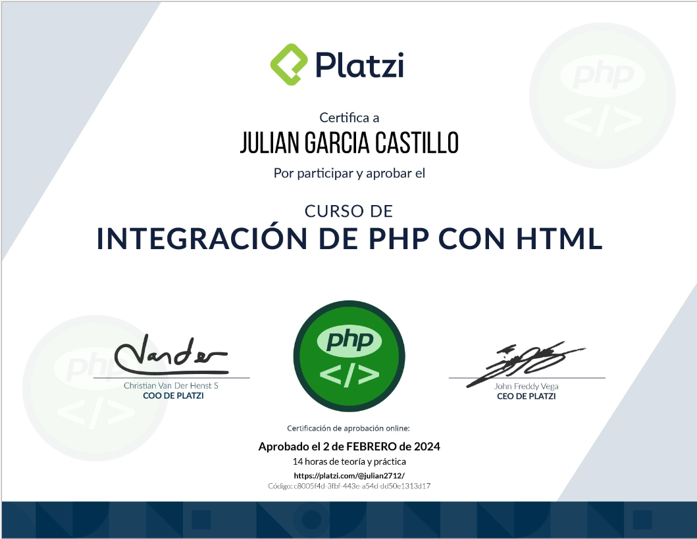

## Ruta PHP
### Curso 4

# Descripción
Aprende cómo hacer integraciones de PHP con HTML siguiendo las mejores prácticas. Desarrolla un formulario con peticiones GET y POST, validación de datos, envío de imágenes y correos. Descubre todos los tipos de render y cómo implementarlos en PHP.
